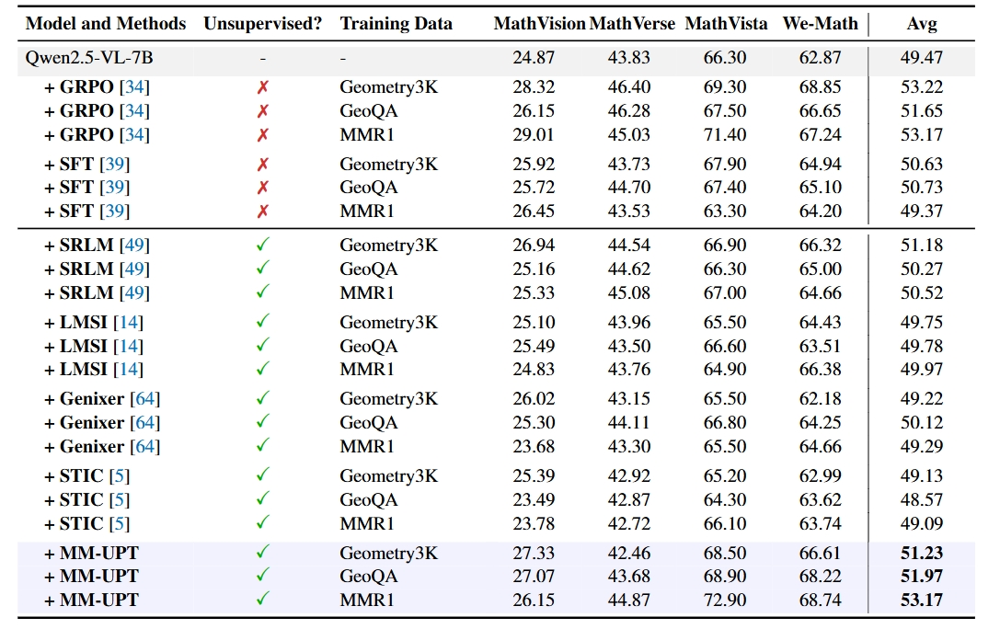
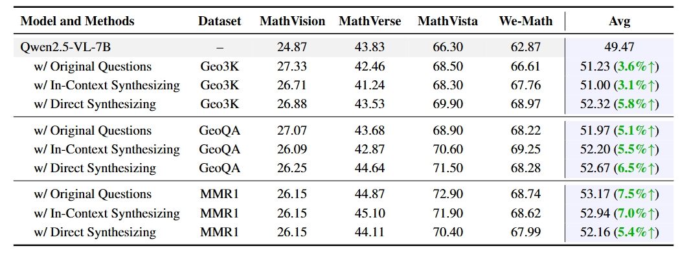

# Unsupervised Post-Training for Multi-Modal LLM Reasoning via GRPO


<div align="center">
  Lai Wei<sup>1,3</sup>,
  Yuting Li<sup>1</sup>,
  Chen Wang<sup>3</sup>,
  Yue Wang<sup>3</sup>,
  Linghe Kong<sup>1</sup>, 
  Weiran Huang<sup>1,2*</sup>
  Lichao Sun<sup>4</sup>
</div>

  
<p align="center">
<i>
1. School of Computer Science, Shanghai Jiao Tong University &nbsp;<br> 2. Shanghai Innovation Institute &nbsp; 3. Zhongguancun Academy &nbsp; <br>  4. Lehigh University &nbsp;
</i>
</p>

<p align="center">
⬇️ <a href="https://huggingface.co/WaltonFuture/Qwen2.5-VL-7B-MM-UPT-MMR1" target="_blank">Model</a> | 📃 <a href="https://arxiv.org/pdf/2505.22453" target="_blank">Paper</a> <br>
</p>


This project is built based on [EasyR1](https://github.com/hiyouga/EasyR1) project to support unsupervised GRPO for multi-modal LLMs. We thank the authors of EasyR1 for providing such a high-performance RL training framework.


## 📚 Introduction

In this work, we are the first to investigate the use of GRPO, a stable and scalable online RL algorithm, for enabling MLLM's continual self-improvement without any external supervision. We propose MM-UPT, a simple yet effective framework for unsupervised post-training of MLLMs. MM-UPT builds upon GRPO, replacing traditional reward signals with a self-rewarding mechanism based on majority voting over multiple sampled responses. Our experiments demonstrate that MM-UPT significantly improves the reasoning ability of Qwen2.5-VL-7B (e.g., 66.3\%→72.9\% on MathVista, 62.9\%→68.7\% on We-Math), using standard dataset without ground truth labels. MM-UPT also outperforms prior unsupervised baselines and even approaches the results of supervised GRPO. Furthermore, we show that incorporating synthetic questions, generated solely by MLLM itself, can boost performance as well, highlighting a promising approach for scalable self-improvement. Overall, MM-UPT offers a new paradigm for continual, autonomous enhancement of MLLMs in the absence of external supervision.

<div align=center>

</div>

## 🌟 Results

We firstly employ standard training datasets with masked labels. MM-UPT achieves consistent improvements in average over the base Qwen2.5-VL-7B model across all datasets, also outperforming other baseline methods such as SRLM, LMSI, Genixer, and STIC. We find that MM-UPT is even competitive with supervised post-training methods, such as rejection sampling-based SFT and GRPO. 

<div align=center>

</div>

In addition, we investigate the use of unlabeled synthetic data to improve MLLMs. This aligns with the ultimate goal of MM-UPT: enabling continual self-improvement even after human-created data is exhausted. Our experiments reveal that both in-context and direct synthesizing lead to significant improvements over the base model, achieving performance comparable to training on original human-written questions. This shows that synthetic questions can effectively enhance the model's reasoning ability under MM-UPT. 

<div align=center>

</div>

## 🚀 Example: Train Qwen2.5-VL-7B using MM-UPT on [MMR1](https://huggingface.co/datasets/MMR1/MMR1-Math-RL-Data-v0) Dataset without Labels


### 🛠️ Setup

```bash
git clone https://github.com/waltonfuture/MM-UPT.git
cd MM-UPT
pip install -e .
```

### Unsupervised GRPO Training

```bash
bash examples/qwen2_5_vl_7b_mmr1.sh
```

### Merge Checkpoint in Hugging Face Format

```bash
python3 scripts/model_merger.py --local_dir checkpoints/mm-upt/qwen2_5_vl_7b_mmr1/global_step_80/actor
```

## ✨ Evaluation

We provide the input format of vllm for the evaluation of our models and Qwen2.5-VL. In particular, we prompt the model to put the final answer into \boxed{}, and then we extract the answer from it.

```bash
from transformers import AutoProcessor
from vllm import LLM, SamplingParams
from qwen_vl_utils import process_vision_info

llm = LLM(
    model=MODEL_PATH, # the model path
    limit_mm_per_prompt={"image": 1, "video": 1},
    dtype=torch.bfloat16,
    gpu_memory_utilization=0.8,
    enforce_eager=True,
    tensor_parallel_size=2,
    trust_remote_code=True
)

sampling_params = SamplingParams(
    max_tokens=16384,
    temperature=0.2,
    stop_token_ids=[],
)

processor = AutoProcessor.from_pretrained(MODEL_PATH,max_pixels = 1204224)

messages = [
    {"role": "system", "content": "You are a helpful assistant."},
    {
      "role": "user",
      "content": [
        {
          "type": "image",
          "image": img, # image path
          "min_pixels": 224 * 224,
          "max_pixels": 1280 * 28 * 28,
        },
        {"type": "text", "text": f'{instruction}'+ " Please reason step by step, and put your final answer within \\boxed{}."}, # instruction is the textual input
      ],
    },
]
prompt = processor.apply_chat_template(
  messages,
  tokenize=False,
  add_generation_prompt=True
)
image_inputs, video_inputs = process_vision_info(messages)
mm_data = {}
mm_data["image"] = image_inputs
llm_inputs = {
  "prompt": prompt,
  "multi_modal_data": mm_data,
}
prompt_list = [llm_inputs]
llm_outputs = llm.generate(prompt_list, sampling_params=sampling_params)
response = llm_outputs[i].outputs[0].text
print(response)
```

## 🎯 Model and Datasets

Our model trained based on the above script is available [here](https://huggingface.co/WaltonFuture/Qwen2.5-VL-7B-MM-UPT-MMR1).

For other standard datasets used in our paper, please refer to:

- [Geometry3K](https://huggingface.co/datasets/hiyouga/geometry3k)

- [GeoQA](https://huggingface.co/datasets/WaltonFuture/GEOQA_R1V_Train_8K)


## 🤗 Using Synthetic Datasets

Please refer to these synthetic datasets built on different seed datasets using two synthetic methods.

| Methods | Geometry3K | GeoQA | MMR1 |
|------------------|------------|-------|------|
| In-Context Synthesizing         |    [Geometry3K-1](https://huggingface.co/datasets/WaltonFuture/geometry3k-in-context-synthesizing)        |   [GeoQA-1](https://huggingface.co/datasets/WaltonFuture/GeoQA-8K-in-context-synthesizing)    |  [MMR1-1](https://huggingface.co/datasets/WaltonFuture/MMR1-in-context-synthesizing)    |
| Direct Synthesizing         |    [Geometry3K-2](https://huggingface.co/datasets/WaltonFuture/geometry3k-direct-synthesizing)         | [GeoQA-2](https://huggingface.co/datasets/WaltonFuture/GeoQA-8K-direct-synthesizing)      | [MMR1-2](https://huggingface.co/datasets/WaltonFuture/MMR1-direct-synthesizing)     |


## 🎁 Acknowledgment

Our models are built upon the amazing [Qwen2.5-VL](https://huggingface.co/collections/Qwen/qwen25-vl-6795ffac22b334a837c0f9a5) family.
We thank [EasyR1](https://github.com/hiyouga/EasyR1)  for the training codes.
We also appreciate that several concurrent works have explored similar ideas. [TTRL](https://github.com/PRIME-RL/TTRL) demonstrates strong performance in test-time training with this approach.
[SRT](https://github.com/tajwarfahim/srt) adopts this paradigm for the unsupervised self-training of LLMs.

## 📮 Contact

Please contact Lai Wei (waltonfuture@sjtu.edu.cn) if needed.

## 📄 Citation
```
@article{wei2025unsupervised,
  title={Unsupervised Post-Training for Multi-Modal LLM Reasoning via GRPO},
  author={Wei, Lai and Li, Yuting and Wang, Chen and Wang, Yue and Kong, Linghe and Huang, Weiran and Sun, Lichao},
  journal={arXiv preprint arXiv:2505.22453},
  year={2025}
}
```
